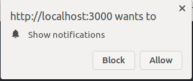
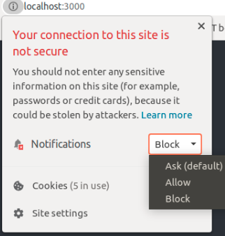

<!-- PROJECT LOGO -->
 

  <h3 align="center">Web Push Notification using Java and React</h3>

  

    Implementing Web Push Notifications for user subscribed events using Java and React technologies.
  

<!-- ABOUT THE PROJECT -->
## About The Project

Using Java as the back end technology and React as the front end technology, browser based Web Push Notifications application is implemented for user subscribed events.
It uses the [Java WebPush](https://github.com/web-push-libs/webpush-java) library for sending messages

Users need to allow for notifications when they are asked inorder to receive the notifications

If the user block the notifications they can change their preferences as shown in the below

When the user wants to stop receiving notifications they can unsubscribe for the particular event so that they will not get notifications further.

<!-- GETTING STARTED -->
## Getting Started

To get up and runing the project follow the following steps.

### Prerequisites

- Java 8+
- Gradle 6+
- Node 10+

### Steps

1. First, generate required a private and public key pair for your server with `npx web-push generate-vapid-keys`. 
2. Replace the public and private key in the application.properties file with the generated keys.
3. Start the Spring Boot application(go inside demo project) by running `PushNotificationApplication.java` or running the jar. Generate the jar using `./gradlew clean build` and run he jar using `java -jar build/libs/demo-0.0.1-SNAPSHOT.jar`.
4. To start the react application(go inside my_app project) first run `npm install` and after that run `npm start`.
5. Navigate to http://localhost:3000/ using your browser.

   

